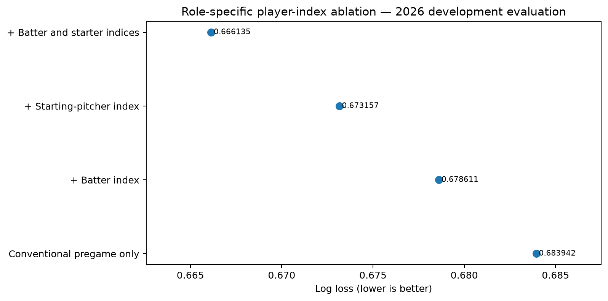

# 15Pick — 역할별 선수 활약 지표를 이용한 KBO 승리확률 연구

[English README](README.md)

## 1분 요약

이 프로젝트는 공식 KBO 경기 기록으로 만든 **역할별 복합 선수 활약도 지표**와 목표 경기 이전의 strict-prior 평균이 기존 팀 전력 변수에 추가적인 경기 전 승리예측 정보를 제공하는지 검증한다.

단순한 모델 하나의 성능을 보여주는 저장소가 아니다. 다음 전체 과정을 재현 가능한 연구 기록으로 남긴다.

- 2024–2026 공식 일정·BoxScore 수집과 canonicalization
- 65,554개 선수-경기 occurrence의 numeric identity 해결
- 현재 경기·같은 날짜·미래 결과를 제외한 strict-prior feature 구축
- 홈/원정 선발투수 identity 비대칭과 역할 혼합 문제 발견·수정
- 신규 타자 점수 215개, 평균법 20개, 라인업 집계법과 모델 적용 방식 비교
- 42개 모델 설정 및 static·rolling·decay·daily retraining·online·calibration·ensemble 비교
- 역할별 ablation, 날짜 단위 bootstrap, calibration, model binary replay, SHA 기반 provenance
- 성능이 나쁘거나 설계가 잘못된 실험도 삭제하지 않고 원인과 판단을 기록

현재 최고 관측 개발 모델은 최근 720경기로 학습한 L2 Logistic Regression `C=0.1`이고, 더 깨끗한 과학적 기준 후보는 2024–2025 temporal CV만으로 선택한 `C=0.03` 모델이다. 두 모델 모두 미래 immutable prospective ledger에서 비교해야 한다.

## 연구 질문

> **공식 KBO 경기 기록으로 생성한 역할별 15Pick 복합 선수 활약도 지표와 목표 경기 이전 평균 활약도는 기존 팀 전력 정보에 추가적인 경기 전 승리예측 정보를 제공하는가? 그리고 타자·선발투수·불펜 중 어떤 역할의 지표가 가장 큰 예측적 가치를 가지는가?**

여기서 선수 “수입”은 연봉·계약가치·배팅수익이 아니라 재현 가능한 경기 활약도 점수다. 목표 경기에서 획득한 점수는 입력으로 사용하지 않고, 목표 날짜보다 이전 경기에서 관측된 평균만 사용한다.

## 핵심 결과

### 2026 개발 평가 416경기 역할별 ablation

| Feature 구성 | Log loss ↓ | Brier ↓ | ROC AUC ↑ | Accuracy ↑ |
|---|---:|---:|---:|---:|
| 기존 경기 전 변수만 | 0.683942 | 0.245313 | 0.575781 | 54.33% |
| + 신규 타자 지표 | 0.678611 | 0.242599 | 0.603188 | 57.45% |
| + clean 선발투수 지표 | 0.673157 | 0.239875 | 0.617343 | 57.93% |
| **+ 타자·선발투수 지표 모두** | **0.666135** | **0.236498** | **0.635275** | **59.62%** |

선수 지표가 없는 기준 모델 대비 결합 모델의 Log loss 차이는 `−0.017807`이며, 날짜 단위 paired bootstrap 95% 구간은 `[-0.033154, -0.002114]`, 개선 확률은 `98.69%`였다.



## 이 프로젝트의 차별점: 실패가 설계를 개선했다

| 발견한 문제 | 증거 | 근본 원인 | 수정 | 결과 |
|---|---|---|---|---|
| 2026 제한 표본 모델의 약한 예측력 | 확률이 0.5 부근에 집중되고 복잡 모델이 악화 | 작은 표본과 반복적 후보 탐색 | 2024–2026 공식 다중 시즌 구축 | 더 안정적인 시간순 비교 가능 |
| 원정 선발투수 prior 부재 | 홈 416건 eligible, 원정 0건 | 홈은 numeric ID, 원정은 이름 token | 선수 identity 재구축과 side별 fail-closed audit | model-period 선발 832/832 해결 |
| 역할 혼합 history | 선발타자 경험행의 78.11%에 교체 출전 이력, 선발투수 경험행의 20.77%에 구원 이력 | history key에 역할 미포함 | role-aware history와 start-only 재설계 | clean starter 지표가 강한 신호가 됨 |
| V3 복잡 모델 실패 | V3 0.677185, V2 0.670610 | feature 증가와 독립 정보 부족 | 규제 Logistic 유지 | negative result 보존 |
| V5 ceiling 결론의 문제 | 역할 오염 발견 후 기존 ceiling 근거 약화 | 잘못된 feature scope에서 상한 측정 | 결론 철회 | 데이터 수정 후 연구 질문 재개 |
| 초기 타자 지표의 incremental gain 실패 | V8에서 V7 stack 악화 | 제한된 점수·평균·집계 탐색 | V11.1에서 공식 이벤트부터 완전 재설계 | 신규 타자 block이 추가 신호 제공 |
| 선수 단위 불펜 지표 실패 | 2025 domain delta +0.000009, stack 악화 | 경기 전 실제 구원투수 배치 불확실 | 팀 단위 post-starter 책임실점 유지 | 실패 원인과 범위 명시 |
| daily retraining 미개선 | adaptive 방식이 static recent-window보다 나쁨 | 작은 표본의 잡음 추종 | clean CV 후보와 development 후보를 모두 보존 | 미래 prospective 비교 필요 |

전체 과정은 [`docs/research_journey.md`](docs/research_journey.md)와 [`docs/failure_root_cause_ledger.md`](docs/failure_root_cause_ledger.md)에 정리돼 있다.

## 데이터 규모

| 항목 | 수 |
|---|---:|
| 공식 일정 행 | 2,047 |
| 완료 경기 | 1,864 |
| 취소·연기 | 183 |
| 타자 occurrence | 47,353 |
| 투수 occurrence | 18,201 |
| 전체 선수-경기 occurrence | 65,554 |
| 공식 선발 라인업 행 | 33,552 |
| identity 해결 | 65,554 / 65,554 |
| 이름만으로 강제 병합 | 0 |
| strict-prior history | 65,554 |
| temporal violation | 0 |

포함된 V12 파생 모델링 데이터는 1,824경기이며, 2024년 710경기, 2025년 698경기, 2026년 416경기다. 공식 KBO raw response 전체는 저장소에서 재배포하지 않는다.

## 타자 활약도 지표

```text
0.50 × 1B + 0.95 × 2B + 1.35 × 3B + 1.85 × HR
+ 0.42 × BB + 0.42 × HBP + 0.22 × SB
− 0.08 × SO − 0.32 × GIDP
```

4.2타석 기준 rate로 환산하고 early-2024 기준으로 평균 1,000, 표준편차 250이 되도록 표준화한다. 같은 시즌 목표 날짜 이전 경기만 사용하여 `K=5` 수축 평균을 만들고, 공식 선발타자 9명의 평균·coverage·prior 경기 수·최소 coverage를 사용한다.

## 선발투수 활약도 지표

```text
1000 × (
  0.216 × 아웃카운트
  + 0.132 × 탈삼진
  − 1.565 × 피홈런
  − 0.557 × (볼넷 + 사구)
)
```

선발 등판만 history에 포함하며 구원 등판은 섞지 않는다. `K=10` 수축 평균과 표본수·신뢰도 feature를 사용한다.

## 누수 방지 계약

- 모든 source game date는 target game date보다 이전
- 목표 경기 결과 제외
- 같은 날짜 모든 경기 결과 제외
- 더블헤더 1차전도 같은 날 2차전 feature에서 제외
- 결측 처리·scaling·모델 선택·calibration은 train 안에서만 fit
- random shuffled split 금지
- target-game actual reliever 사용 금지
- 취소 경기 void/exclude
- 날짜 단위 paired bootstrap 사용

**2026 각 경기 내부에는 누수가 없지만, 2026 결과는 학습전략 비교 과정에서 관찰됐다.** 따라서 2026은 development evaluation이며 final untouched test가 아니다.

## 모델 지위

| 모델 | 선택 근거 | 학습 | 2026 Log loss | 지위 |
|---|---|---|---:|---|
| `L2_C0.03_ALL_EQUAL` | 2024–2025 temporal CV | 2024+2025 전체 | 0.667390 | 과학적으로 깨끗한 기준 후보 |
| `L2_C0.1_RECENT_720` | 2026 방법 비교 후 선택 | 최근 720경기 | 0.666135 | 현재 최고 관측 개발 후보 |

미래 성능이 검증된 production champion은 아직 없다. 다음 단계는 두 모델의 immutable prospective ledger다.

## 핵심 결과 재현

```bash
python3 -m venv .venv
source .venv/bin/activate
python -m pip install --upgrade pip
pip install -e ".[dev]"
make reproduce
make verify
```

`make reproduce`는 포함된 1,824경기 파생 모델링 데이터에서 두 동결 모델과 4개 역할별 ablation 모델을 다시 학습하고 metric, prediction, bootstrap, calibration, coefficient를 생성한다.

`make verify`는 row count, 시간순 정렬, same-date flag, SHA256, 공개 metric, bootstrap, model binary replay를 fail-closed 방식으로 검사한다.

## 권장 읽기 순서

1. [`docs/research_question_and_contribution.md`](docs/research_question_and_contribution.md)
2. [`docs/research_journey.md`](docs/research_journey.md)
3. [`docs/failure_root_cause_ledger.md`](docs/failure_root_cause_ledger.md)
4. [`docs/data_lineage_and_quality.md`](docs/data_lineage_and_quality.md)
5. [`docs/temporal_validation_and_leakage.md`](docs/temporal_validation_and_leakage.md)
6. [`docs/model_selection_ablation_and_calibration.md`](docs/model_selection_ablation_and_calibration.md)
7. [`docs/reproducibility.md`](docs/reproducibility.md)
8. [`docs/scientific_status_and_claims.md`](docs/scientific_status_and_claims.md)

## 작성자

Jiho Choi — The Ohio State University, Data Analytics
