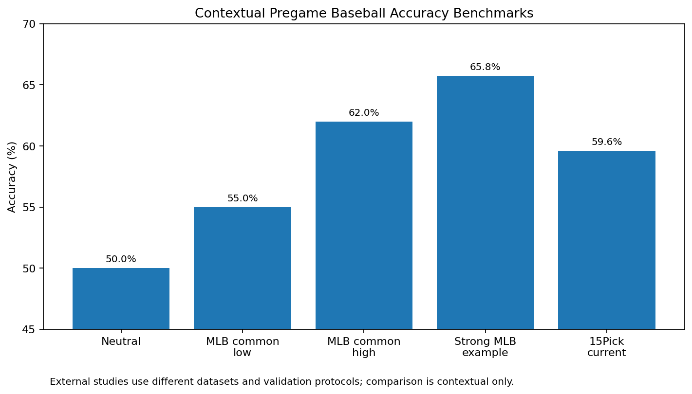
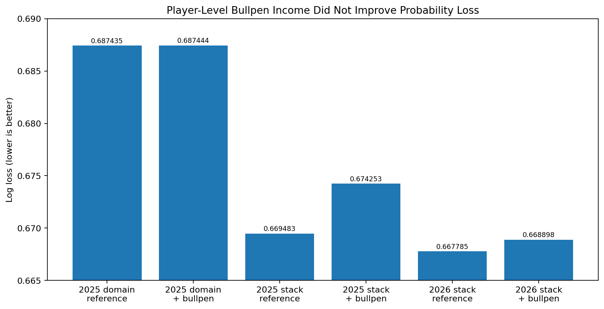

# 15Pick — Do Player-Income Indices Improve KBO Win-Probability Forecasts?

[](#reproduction)
[](#research-question)
[](#methodology)
[](#scientific-status)

**15Pick KBO Player-Income Research** evaluates whether a compact, role-specific summary of player performance preserves information that is useful for pregame baseball forecasting.

## Why this research exists

I originally built **15Pick**, a fantasy-sports and point-based prediction platform, to make complex baseball records easier for fans to understand. Hits, walks, strikeouts, double plays, innings, home runs allowed, and many other events are difficult to compare directly—especially across batters and pitchers.

15Pick therefore converts official game records into one intuitive **player-income score**. The score was designed as a product interface: a single number that helps users compare how strongly players performed.

That product decision created a scientific question:

> **Does the simplified player-income representation preserve meaningful information about future game outcomes, or is it only a convenient description of past performance?**

The repository tests that question through official KBO data engineering, player-identity resolution, role-specific index design, strict point-in-time features, temporal machine learning, ablation studies, and probability-focused evaluation.

## Research Question

> **Do role-specific, strictly prior composite player-performance indices derived from official KBO game records improve pregame KBO win-probability forecasts beyond models based on conventional team strength and pregame records?**

### Korean

> **공식 KBO 경기 기록으로 구축한 역할별 strict-prior 복합 선수 활약도 지표는 기존 팀 전력과 일반적인 경기 전 기록만 사용하는 모델보다 KBO 경기의 승리확률 예측을 개선하는가?**

## Main Finding

**Retrospective evidence supports the hypothesis.** Under the same model family, training window, and conventional pregame features, adding prior-average batter and starting-pitcher income indices improved every primary metric.

### Best observed development comparison — 416 games in 2026

| Model | Log loss ↓ | Brier ↓ | ROC AUC ↑ | Accuracy ↑ |
|---|---:|---:|---:|---:|
| Conventional pregame features, **no player income** | 0.683942 | 0.245313 | 0.575781 | 54.33% |
| Conventional features + **batter and starter income** | **0.666135** | **0.236498** | **0.635275** | **59.62%** |
| Change | **−0.017807** | **−0.008815** | **+0.059494** | **+5.29 pp** |

Date-cluster bootstrap, 20,000 repetitions:

- Probability that the full-income model improves Log loss: **98.69%**
- 95% interval for `full − no income`: **[−0.033154, −0.002114]**


### Role ablation

| Player-income block | Log loss ↓ | Brier ↓ | ROC AUC ↑ | Accuracy ↑ |
|---|---:|---:|---:|---:|
| No player income | 0.683942 | 0.245313 | 0.575781 | 54.33% |
| Batter income only | 0.678611 | 0.242599 | 0.603188 | 57.45% |
| Starting-pitcher income only | 0.673157 | 0.239875 | 0.617343 | 57.93% |
| **Batter + starting-pitcher income** | **0.666135** | **0.236498** | **0.635275** | **59.62%** |

Starting-pitcher income produced the larger individual improvement, while batter income supplied additional complementary information.

## How good is a baseball prediction model?

Baseball is intrinsically difficult to predict before first pitch. Published MLB next-game research commonly reports accuracy in roughly the **55–62%** range. A 2016 past-data-only MLB study reported nearly **60%** mean accuracy, while a 2022 study reported a strong result of **65.75% accuracy and 0.6501 AUC** after feature selection.

These studies are useful context, not a direct leaderboard: leagues, seasons, features, and validation designs differ, and many published studies use random or stratified cross-validation rather than the strict temporal evaluation used here.

| Reference level | Accuracy | ROC AUC | Log loss | Brier |
|---|---:|---:|---:|---:|
| Neutral 0.5 probability forecast | 50% | 0.500 | 0.6931 | 0.2500 |
| Common published MLB range | 55–62% | varies | often not reported | often not reported |
| Strong published MLB example | 65.75% | 0.6501 | not reported | not reported |
| **15Pick current retrospective model** | **59.62%** | **0.6353** | **0.6661** | **0.2365** |

### Project success criteria

1. **Scientific success:** player-income features must improve Log loss and Brier score against the same-protocol no-income model, preferably with a paired date-cluster interval below zero.
2. **Competitive baseball forecasting:** frozen future predictions should sustain approximately **60% accuracy and AUC ≥ 0.63**, while remaining calibrated.
3. **Aspirational target:** approach the stronger published MLB range—approximately **0.65 AUC and 62–65% accuracy**—under stricter temporal, pregame-only validation.
4. **Final confirmation:** all claims must survive an immutable prospective prediction ledger; retrospective tuning alone is not sufficient.

Accuracy is secondary. The primary outputs are probabilities, so **Log loss, Brier score, and calibration** govern model selection.



Detailed benchmark definitions and references are in [`docs/external_benchmarks_and_success_criteria.md`](docs/external_benchmarks_and_success_criteria.md).

## Why player-level bullpen income was rejected

A player-level relief-pitcher income index did **not** improve prediction quality.

| Evaluation | Reference | + Player-level bullpen income | Change in Log loss |
|---|---:|---:|---:|
| 2025 bullpen-domain model | 0.687435 | 0.687444 | **+0.000009** |
| 2025 added to the starter stack | 0.669483 | 0.674253 | **+0.004770** |
| 2026 post-hoc added to the starter stack | 0.667785 | 0.668898 | **+0.001113** |

Positive changes are worse. The standalone 2025 comparison produced only a **49.95% probability of improvement**, effectively a null result.

This negative result is plausible for structural reasons:

- The target game's actual relievers are unknown before first pitch.
- Bullpen deployment depends on the starter's exit time, score, leverage, handedness matchups, and managerial choices that develop during the game.
- Reliever availability changes with recent workload, consecutive-day use, injury, and recovery.
- Relief pitchers work in smaller samples than starters, making individual averages noisier and more volatile.
- Using the relievers who actually appeared would leak postgame deployment information; using a broad pregame pool dilutes the signal across pitchers who may never enter.

The final model therefore uses a **team-level recent post-starter responsibility-run feature** rather than forcing player-level bullpen income into the predictor. The result does not mean relief pitching is unimportant; it means that the tested player-level pregame representation was not sufficiently identifiable or stable.



See [`docs/bullpen_income_negative_result.md`](docs/bullpen_income_negative_result.md).

## Scientific Status

The repository separates two claims:

1. **CV-selected specification:** model family and regularization were selected using temporal cross-validation on 2024–2025. On 2026, adding all player-income features reduced Log loss from `0.683516` to `0.667390`.
2. **Best observed development specification:** the recent-720-game strategy produced the strongest 2026 result, reducing Log loss from `0.683942` to `0.666135`.

The second result is the current development champion, but 2026 was repeatedly observed during research. It is therefore **not an untouched final test**. A frozen prospective prediction ledger is required for the final generalization claim.

## Why This Project Is More Than a Sports Prediction Model

This is a study of **representation value**:


The central contribution is not simply a classifier. It is the design and evaluation of a compact player-performance representation under realistic temporal constraints.

## Data Foundation

| Component | Scale |
|---|---:|
| Official completed games | 1,864 |
| Seasons | 2024, 2025, 2026 through July 9 |
| Player-game occurrences | 65,554 |
| Batter occurrences | 47,353 |
| Pitcher occurrences | 18,201 |
| Official starting-lineup rows | 33,552 |
| Resolved player occurrences | 65,554 / 65,554 |
| Same-date temporal violations | 0 |

The public repository does not redistribute the full official raw dataset. It provides schemas, synthetic examples, maintained research code, aggregate results, and reproducibility instructions.

## Player-Income Indices

### Batter index

The selected batter system scores official plate-appearance events, converts the score to a 4.2-PA rate, standardizes it around 1,000, and forms a strict-prior player mean with `K=5` shrinkage toward the previous-season mean.

| Event | Weight |
|---|---:|
| Single | 0.50 |
| Double | 0.95 |
| Triple | 1.35 |
| Home run | 1.85 |
| Walk / HBP | 0.42 |
| Stolen base | 0.22 |
| Strikeout | −0.08 |
| Grounded into double play | −0.32 |

The game feature aggregates the official nine-player starting lineup using the mean prior index plus coverage and reliability variables.

### Starting-pitcher index

Starting pitchers are evaluated from **prior starts only**, without mixing relief appearances. The game index combines recorded outs and strikeouts with penalties for home runs, walks, and hit batters. A `K=10` cross-season shrinkage mean stabilizes early-season estimates.

Detailed definitions are in [`docs/player_income_index.md`](docs/player_income_index.md).

## Methodology

- Official KBO schedule and GameCenter records
- Numeric player identity resolution rather than name-only joins
- Current-game and same-date results excluded
- Doubleheader Game 1 excluded from Game 2 features on the same date
- Train-only imputation and scaling
- Temporal cross-validation rather than shuffled splits
- Probability-first model selection using Log loss and Brier score
- Date-cluster bootstrap for paired uncertainty
- Explicit feature-group ablation

See [`docs/temporal_validation.md`](docs/temporal_validation.md).

## Model and Training-Strategy Search

The study compared:

- L2 logistic regression
- Elastic Net
- Random Forest and Extra Trees
- Gradient boosting and histogram boosting
- XGBoost, LightGBM, and CatBoost
- Probability blending, stacking, and calibration
- Full-history, recent-window, time-decay, rolling, expanding, and daily-update strategies

The strongest and most stable family was regularized logistic regression. The best observed development configuration was:

```yaml
model: L2 logistic regression
C: 0.1
training_strategy: most recent 720 decision games
features: team strength + post-starter team runs + starter income + batter income
```

Complexity did not automatically improve generalization; several tree and ensemble models were rejected after worse temporal probability performance.

## Research Progress and Failure Analysis

1. A 2026-only limited-sample model produced weak, compressed probabilities.
2. Multi-season data improved estimation stability.
3. A broad high-dimensional model search underperformed regularized logistic regression.
4. A role audit found that early histories mixed substitute/starter and starter/reliever appearances.
5. The starting-pitcher index was rebuilt from start-only records.
6. Player-level bullpen income produced a null or negative incremental result.
7. Additional workload, handedness, and lineup-interaction features did not improve probability loss.
8. A new batter index was selected from 215 official-event candidates.
9. Forty-two model and learning-strategy configurations were compared.
10. The final ablation directly tested all player-income features against a no-income model.

See [`docs/experiment_history.md`](docs/experiment_history.md) and [`docs/failure_analysis.md`](docs/failure_analysis.md).

## Repository Structure

```text
.
├── src/fifteenpick_rq1/      # maintained index, temporal, modeling, and evaluation code
├── scripts/                  # reproducible command-line entry points
├── configs/                  # frozen formulas and model specifications
├── experiments/              # key experiment cards and research scripts
├── reports/                  # published aggregate results and figures
├── docs/                     # design, benchmarks, lineage, failures, and limitations
├── data/schema/              # public schemas
├── data/sample/              # synthetic examples only
├── tests/                    # temporal, formula, and result-verification tests
└── models/                   # model registry
```

## Reproduction

```bash
python -m venv .venv
source .venv/bin/activate
pip install -e ".[dev]"
python scripts/verify_published_results.py
pytest
ruff check src scripts tests
```

Re-run the primary ablation with a local modeling dataset:

```bash
python scripts/reproduce_primary_ablation.py \
  --data /path/to/V12_MODELING_DATASET.csv \
  --protocol best-development \
  --output reports/reproduced_primary_ablation.csv
```

The complete official dataset is intentionally not committed. Required columns are documented in [`data/schema/modeling_dataset_schema.csv`](data/schema/modeling_dataset_schema.csv).

## Limitations

- The strongest recent-720 result is retrospective development evidence, not a pristine final test.
- Historical official lineups were reconstructed from completed game pages rather than contemporaneously archived confirmation feeds.
- Exact physical runs after starter exit require play-by-play substitution and scoring timelines.
- Market odds, weather, injuries, travel, and verified historical bullpen availability are outside the primary feature set.
- External MLB comparisons are contextual because their datasets and validation protocols differ.
- Prediction quality does not by itself establish betting profitability.
- Final external validity requires frozen prospective predictions.

## Next Step

Freeze the current model, store each future prediction before first pitch with input and model hashes, and evaluate the immutable ledger using Log loss, Brier score, calibration, AUC, accuracy, and date-cluster uncertainty.

## References

- Soto Valero, C. (2016). *Predicting Win-Loss outcomes in MLB regular season games—A comparative study using data mining methods*. International Journal of Computer Science in Sport, 15(2), 91–112. https://doi.org/10.1515/ijcss-2016-0007
- Li, S.-F., Huang, M.-L., & Li, Y.-Z. (2022). *Exploring and Selecting Features to Predict the Next Outcomes of MLB Games*. Entropy, 24(2), 288. https://doi.org/10.3390/e24020288
- Greenhouse, M., Reiter, J. P., & Zahran, S. (2019). *Out of gas: quantifying fatigue in MLB relievers*. Journal of Quantitative Analysis in Sports. https://doi.org/10.1515/jqas-2018-0007
- Hirotsu, N., & Wright, M. (2005). *Modelling a baseball game to optimise pitcher substitution strategies incorporating handedness of players*. IMA Journal of Management Mathematics, 16(2), 179–194. https://doi.org/10.1093/imaman/dpi009

## License and Data Use

Code and original documentation are released under the MIT License. Official KBO source data remains subject to its original rights and terms; this repository does not redistribute the complete raw archive.
