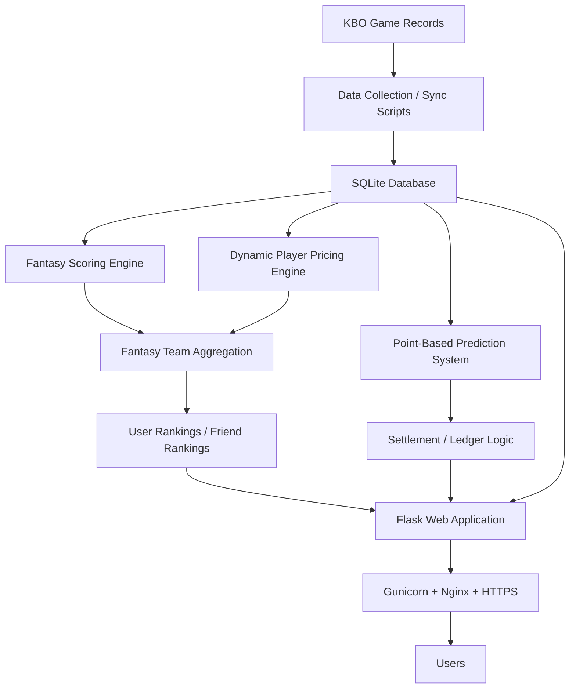
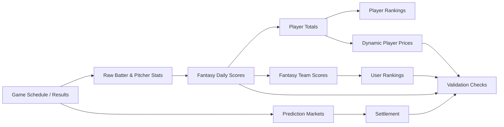

# MyPick — KBO Sports Analytics & Fan Engagement Platform

**MyPick is a production-deployed KBO sports analytics and fan engagement platform that turns complex baseball records into fantasy scores, player rankings, dynamic price movements, team competition, friend rankings, and point-based prediction experiences.**

MyPick was built around one idea:

> Sports data becomes more valuable when it helps fans understand, decide, compete, and participate.

Instead of only displaying KBO records, MyPick translates player performance into easier-to-read indicators and connects those indicators to fantasy team building, ranking competition, player value strategy, and daily game predictions.

[Live Site](https://mypickkbo.com) · [Documentation](docs/) · [Tech Stack](#tech-stack) · [System Architecture](#system-architecture)

---

## Table of Contents

- [Overview](#overview)
- [Why This Project Matters](#why-this-project-matters)
- [Key Highlights](#key-highlights)
- [Product Features](#product-features)
- [What Makes MyPick Different](#what-makes-mypick-different)
- [Analytics & Data System](#analytics--data-system)
- [System Architecture](#system-architecture)
- [Core Modules](#core-modules)
- [Data Pipeline](#data-pipeline)
- [Tech Stack](#tech-stack)
- [Deployment & Operations](#deployment--operations)
- [Validation & Data Quality](#validation--data-quality)
- [Screenshots](#screenshots)
- [Security & Privacy](#security--privacy)
- [Roadmap](#roadmap)
- [Korean Summary](#korean-summary)
- [Author](#author)

---

## Overview

Baseball is a data-rich sport, but raw records are not always easy for casual fans to interpret.

KBO games produce many different statistics across batters, starting pitchers, bullpen pitchers, team results, and recent player performance. For users who are new to baseball or who do not want to analyze every box score manually, it can be difficult to quickly understand questions like:

- Which players are performing well right now?
- Which players are rising or falling?
- How should batters and pitchers be compared?
- Which players are valuable for building a fantasy team?
- How can game data become something fans can actively participate in?

MyPick addresses this by converting KBO records into fan-friendly indicators:

- **Fantasy scores** summarize player performance.
- **Batter and pitcher rankings** make comparison easier.
- **Dynamic player prices** reflect value changes over time.
- **Price movements** help users notice hot streaks, slumps, and potential upside.
- **Fantasy teams, rankings, friend rankings, and point-based predictions** turn sports data into participatory content.

The goal is not just to show baseball data. The goal is to make baseball easier to understand and more enjoyable to follow.

---

## Why This Project Matters

Many sports websites present schedules, results, standings, and raw player statistics. Those are useful, but they often assume that users already know how to interpret the numbers.

MyPick starts from a different perspective:

> What if baseball records could be transformed into a more accessible and participatory fan experience?

The platform turns complex KBO data into simplified but meaningful signals. Users do not need to know every advanced baseball statistic to understand player performance. They can look at fantasy points, rankings, price levels, and price changes to understand a player’s current form, consistency, value, and trend.

From there, users can make decisions:

- Build their own fantasy team
- Choose players under budget constraints
- Compare their team with other users
- Compete in overall rankings
- Compare with friends through friend rankings
- Predict daily KBO game outcomes using points
- Think strategically about player upside and release profit

This makes MyPick both a sports analytics project and a fan engagement product.

---

## Key Highlights

- Built a full-stack KBO sports analytics web application with Python, Flask, SQLite, Jinja templates, CSS, and JavaScript
- Designed a role-aware fantasy scoring system for batters, starting pitchers, and bullpen pitchers
- Implemented dynamic player pricing to reflect player performance, value movement, hot streaks, and slumps
- Built fantasy team construction with budget constraints, roster slots, captain selection, and team confirmation logic
- Added overall user rankings and friend-based rankings to support both public competition and social competition
- Developed a point-based prediction system with market creation, bet placement, settlement, payouts, and betting history
- Added release-profit logic so users can benefit from identifying undervalued or rising players
- Automated daily data updates using Python scripts and scheduled server jobs
- Deployed the service with AWS Lightsail, Ubuntu, Gunicorn, Nginx, HTTPS, and production-safe configuration
- Prepared this repository as a portfolio-safe version without production database files, secrets, logs, backups, or private credentials

---

## Product Features

| Feature | Purpose |
|---|---|
| Fantasy Scores | Converts raw player records into easy-to-read performance indicators |
| Batter / Pitcher Rankings | Helps users compare players without manually analyzing every raw statistic |
| Dynamic Player Prices | Shows player value movement, hot streaks, slumps, and market-like trends |
| Price Change Tracking | Makes rising and falling players easier to notice at a glance |
| Fantasy Team Management | Lets users build a team using KBO players under budget and roster constraints |
| Captain System | Adds strategic weight to team construction |
| Overall User Rankings | Gives all users a shared ranking ecosystem and long-term motivation |
| Friend Features | Allows users to add friends and compare performance socially |
| Friend Rankings | Preserves the private-group competition of traditional fantasy sports |
| Point-Based Predictions | Lets users participate in daily KBO games through prediction-based engagement |
| Release Profit Logic | Rewards users for identifying undervalued or rising players before their value increases |
| Mobile UI | Supports a more accessible experience across desktop and mobile layouts |

---

## What Makes MyPick Different

Traditional fantasy sports products often focus on private leagues among small groups of friends. That structure is fun, but it can be limiting for new users who do not already have a group to play with.

MyPick is built around a broader ranking ecosystem.

All users can participate in the same competitive environment through overall rankings, while friend features and friend rankings still preserve the social competition of private fantasy leagues.

MyPick also adds additional strategic layers:

### 1. Player data becomes easier to understand

Users do not need to analyze every raw baseball statistic. Fantasy scores, batter rankings, pitcher rankings, and player price changes provide a more direct way to understand player performance, form, and value.

### 2. Dynamic prices show player trends

A player’s price movement becomes an intuitive signal of recent performance and value change. Users can identify rising players, falling players, stable performers, and possible undervalued options.

### 3. Team building becomes a strategy problem

Users are not simply choosing favorite players. They must consider budget, position, role, captain value, current price, future upside, and ranking impact.

### 4. Release profit creates value-based play

MyPick rewards users who identify players before their value rises. This adds a player valuation layer beyond simple score accumulation.

### 5. Predictions make daily games more interactive

Point-based predictions give users another reason to follow daily KBO games. The system is based on platform points, not real-money gambling.

Together, these systems turn KBO records into participatory sports content.

---

## Analytics & Data System

MyPick converts KBO game records into user-facing analytics through several connected systems.

| System | Role |
|---|---|
| Data Collection | Syncs KBO schedules, game results, and player records |
| Raw Stat Storage | Stores batter and pitcher records separately |
| Fantasy Scoring | Converts player performance into role-aware fantasy points |
| Player Rankings | Organizes players into easier comparison views |
| Dynamic Pricing | Updates player prices based on performance and role |
| Team Aggregation | Calculates fantasy team scores from selected players |
| Ranking System | Produces overall rankings, team rankings, and friend rankings |
| Prediction System | Handles point-based prediction markets and settlement |
| Ledger Logic | Tracks stakes, payouts, and point movements |
| Validation Scripts | Checks score consistency, price integrity, roster rules, and settlement results |

---

## System Architecture

---

## Core Modules

| File / Directory | Purpose |
|---|---|
| `app.py` | Main Flask application, routes, authentication flow, user pages, team management, rankings, profiles, and UI logic |
| `db.py` | Database initialization and schema-related logic |
| `scoring.py` | Fantasy scoring rules and scoring helper logic |
| `calculate_team_daily_scores.py` | Aggregates player scores into fantasy team scores |
| `update_market_prices_v3.py` | Dynamic player price update logic |
| `betting.py` | Point-based prediction market, odds, bet placement, payout, and ledger logic |
| `settle_betting.py` | Prediction settlement workflow |
| `sync_db.py` | Daily database synchronization workflow |
| `sync_betting_games.py` | Betting-game synchronization workflow |
| `scraper.py` | KBO data collection helpers |
| `scheduler.py` | Scheduled update orchestration |
| `audit_mypick_integrity.py` | Data integrity and consistency checks |
| `price_reactivity_report.py` | Price movement validation and reactivity checks |
| `trade_bonus_report.py` | Release-profit and trade-bonus validation |
| `position_rules.py` | Position and roster eligibility rules |
| `templates/` | Jinja HTML templates for the web interface |
| `static/` | CSS, icons, SEO assets, and static images |
| `deploy/` | Deployment examples for systemd, Nginx, and update scripts |
| `docs/` | Project documentation |
| `sample_data/` | Planned anonymized sample data for portfolio demonstration |
| `screenshots/` | Planned portfolio-safe screenshots |

---

## Data Pipeline

The daily update pipeline transforms game records into user-facing content.

The pipeline supports:

- Schedule and result synchronization
- Raw batter and pitcher stat storage
- Fantasy score calculation
- Player total aggregation
- Fantasy team score aggregation
- Dynamic player price updates
- Player ranking refreshes
- User and friend ranking updates
- Point-based prediction market settlement
- Data validation reports

---

## Tech Stack

| Layer | Technologies |
|---|---|
| Backend | Python, Flask |
| Database | SQLite |
| Frontend | Jinja Templates, HTML, CSS, JavaScript |
| Data Processing | Python, pandas, NumPy |
| Data Collection | requests, BeautifulSoup |
| Scheduling | systemd timer, APScheduler |
| Deployment | AWS Lightsail, Ubuntu, Gunicorn, Nginx |
| Security / Configuration | Environment variables, HTTPS, production-safe secret handling |
| SEO | robots.txt, sitemap.xml, Google Search Console, Naver Webmaster Tools |

---

## Deployment & Operations

MyPick is deployed as a live web application using a production server environment.

Deployment and operations include:

- AWS Lightsail server
- Ubuntu-based deployment
- Flask application served with Gunicorn
- Nginx reverse proxy
- HTTPS with Certbot
- systemd web service for the application
- systemd timer/service for automated daily updates
- Environment-based production configuration
- Portfolio-safe repository separation from production data and secrets

The live deployment is part of the project’s value: MyPick is not only a local prototype, but an operated sports data product.

---

## Validation & Data Quality

Because MyPick connects raw game records, player scores, player prices, fantasy teams, rankings, and prediction settlement, validation is an important part of the system.

Validation areas include:

- Database integrity checks
- Missing game data detection
- Missing fantasy score detection
- Player price consistency checks
- Price reactivity checks
- Position eligibility checks
- Roster budget validation
- Team score aggregation checks
- Release-profit validation
- Prediction market settlement checks
- Betting ledger consistency checks

These checks help keep daily updates reliable and reduce the risk of inconsistent user-facing results.

---

## Screenshots

Screenshots will be added after portfolio-safe visual review.

Planned screenshot set:

- Center dashboard
- Player rankings
- Player detail page
- Team edit / roster construction
- My team page
- User rankings
- Friend rankings
- Point-based prediction page
- Mobile layout

---

## Repository Status

This repository is currently maintained as a portfolio-safe version of the production project.

It is intended to show:

- Project structure
- Full-stack implementation
- Data pipeline logic
- Fantasy scoring and pricing logic
- Prediction system logic
- Deployment examples
- Documentation and portfolio materials

It is not intended to expose production data, private server files, user-sensitive information, or operational secrets.

---

## Security & Privacy

This repository does not include:

- Production database files
- Environment secrets
- Server logs
- Backups
- SSH keys or `.pem` files
- SSL keys or certificates
- User-sensitive data
- Private deployment credentials

Example configuration files are included only with placeholder values.

---

## Roadmap

Planned improvements include:

- Add portfolio-safe screenshots
- Add anonymized sample datasets
- Expand documentation for scoring, pricing, and prediction systems
- Add database schema documentation
- Improve automated validation reports
- Add more unit and integration tests
- Build a GitHub Pages case study
- Explore more advanced player valuation methods
- Add more product analytics and user engagement metrics

---

## Korean Summary

MyPick은 복잡한 KBO 경기 기록과 선수 데이터를 팬들이 쉽게 이해할 수 있는 판타지 점수, 타자/투수 순위, 동적 선수 가격, 가격 변동으로 변환하는 스포츠 데이터 플랫폼입니다.

사용자는 세부 야구 기록을 모두 분석하지 않아도 선수의 성과, 기복, 상승세, 하락세, 가치 변화를 직관적으로 이해할 수 있습니다. 또한 직접 판타지 팀을 구성하고, 전체 랭킹과 친구 랭킹에서 경쟁하며, 포인트 기반 승부예측에 참여하면서 KBO를 더 쉽고 능동적으로 즐길 수 있습니다.

MyPick은 기존의 폐쇄적인 친구 리그 중심 판타지 스포츠와 달리, 모든 유저가 함께 경쟁하는 전체 랭킹 생태계를 중심으로 설계되었습니다. 동시에 친구 추가와 친구 랭킹 기능을 통해 기존 판타지 스포츠의 소셜 경쟁 경험도 제공합니다.

---

## Author

**Jiho Choi**  
Data Analytics Student  
Interested in sports analytics, data products, full-stack analytics platforms, and fan engagement systems.
