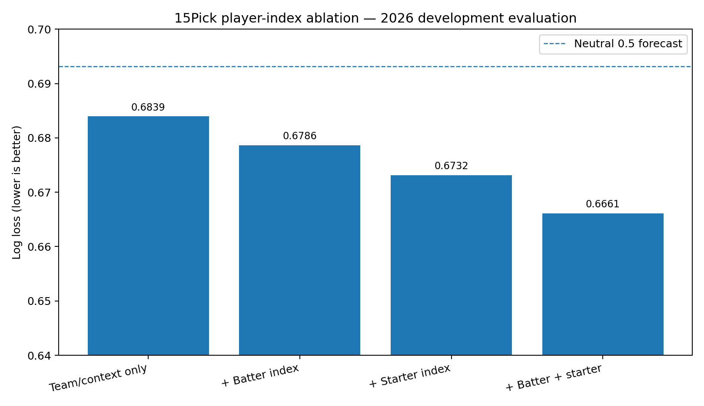
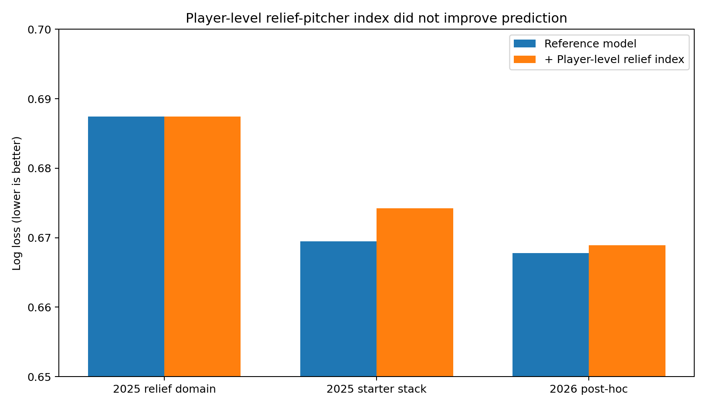

# 15Pick — KBO Win-Probability Prediction with Role-Aware Player Performance Indices

[](#reproduction)
[](#research-question)
[](#validation-design)
[](#scientific-status)

**15Pick** is a leakage-controlled KBO pregame win-probability project. Its central question is whether compact, role-aware summaries of player performance add useful predictive information beyond conventional team-strength and pregame context variables.

[한국어 README](README.ko.md)

## Project Motivation

15Pick began as a fantasy-sports and point-based prediction platform. Baseball performance is distributed across many heterogeneous events: singles, extra-base hits, walks, strikeouts, double plays, innings recorded, home runs allowed, and more. These records are informative, but they are not easy for every fan to compare directly—especially across batting and pitching roles.

The platform therefore transformed official game records into a single, intuitive **player performance score**. The product goal was interpretability: let users compare how strongly players had performed without requiring them to inspect dozens of statistics separately.

That design choice led to a research problem. A score can be easy to understand while still discarding important information. This repository tests whether the compressed representation has value beyond presentation:

> **Does a role-aware player performance index preserve information that improves prediction of future KBO game outcomes?**

The repository is therefore organized around a **win-probability model**, not around the score itself. The player indices are candidate predictive inputs whose incremental value is tested through controlled ablation.

## Research Question

> **Do role-specific, strictly prior composite player performance indices derived from official KBO game records improve pregame KBO win-probability forecasts beyond models based on conventional team strength and pregame records?**

### Korean

> **공식 KBO 경기 기록으로 구축한 역할별 strict-prior 복합 선수 활약 지표는 기존 팀 전력과 일반적인 경기 전 정보만 사용하는 모델보다 KBO 경기의 승리확률 예측을 개선하는가?**

## Main Result

Retrospective temporal evidence supports the research hypothesis. Under the same model family, training window, and conventional pregame variables, adding batter and starting-pitcher performance indices improved every primary metric.

### Best observed development comparison — 416 decision games in 2026

| Feature set | Log loss ↓ | Brier ↓ | ROC AUC ↑ | Accuracy ↑ |
|---|---:|---:|---:|---:|
| Conventional pregame variables only | 0.683942 | 0.245313 | 0.575781 | 54.33% |
| + Batter performance index only | 0.678611 | 0.242599 | 0.603188 | 57.45% |
| + Starting-pitcher performance index only | 0.673157 | 0.239875 | 0.617343 | 57.93% |
| **+ Batter and starting-pitcher indices** | **0.666135** | **0.236498** | **0.635275** | **59.62%** |

Compared with the no-player-index baseline, the combined model achieved:

- Log-loss improvement: **−0.017807**
- Brier improvement: **−0.008815**
- ROC AUC improvement: **+0.059494**
- Accuracy improvement: **+5.29 percentage points**
- Date-cluster bootstrap probability of lower Log loss: **98.69%**
- 95% bootstrap interval for the Log-loss difference: **[−0.033154, −0.002114]**



The combined result also matters scientifically because the batter-only and starter-only models each improved over the baseline, while the combined model improved further. This suggests that the two role-specific representations contain partially complementary information.

## External Baseball Forecasting Context

There is no universal accuracy threshold for a “good” baseball model. Performance depends on the league, prediction unit, information timing, class balance, features, and validation protocol. Published MLB next-game studies summarized by Li, Huang, and Li (2022) commonly fall around **55–62% accuracy**. Their own feature-selected SVM reported **65.75% accuracy and 0.6501 ROC AUC**, while Soto Valero (2016) reported **58.92% accuracy** for the strongest model in that study.

These values are used as context—not as a direct leaderboard—because the published studies use different datasets and validation designs.

| Reference level | Accuracy | ROC AUC | Log loss | Brier |
|---|---:|---:|---:|---:|
| Neutral 0.5 forecast | 50.00% | 0.5000 | 0.6931 | 0.2500 |
| Broad published MLB context | approximately 55–62% | varies | often not reported | often not reported |
| Strong published MLB example | 65.75% | 0.6501 | not reported | not reported |
| **15Pick retrospective development model** | **59.62%** | **0.6353** | **0.6661** | **0.2365** |

The current result is within the broad published baseball-prediction range and approaches the stronger reported AUC context. It is not yet a final confirmatory result because 2026 was observed during development.

### Success criteria for future frozen evaluation

1. **Incremental scientific value:** the player-index model must outperform the identical no-player-index model on both Log loss and Brier score.
2. **Competitive forecasting context:** prospective performance should remain near **60% accuracy** and **ROC AUC ≥ 0.63**, with stable calibration.
3. **Aspirational target:** approach **ROC AUC ≈ 0.65** without sacrificing Log loss, Brier score, or calibration.
4. **Confirmatory requirement:** all final claims must survive an immutable prospective prediction ledger.

Accuracy is secondary because 15Pick outputs probabilities. Log loss, Brier score, and calibration are the primary standards.

See [`docs/external_benchmarks_and_success_criteria.md`](docs/external_benchmarks_and_success_criteria.md).

## Relief-Pitcher Index: Negative Result

Adding a player-level relief-pitcher performance index did not improve the tested pregame models.

| Evaluation | Reference Log loss | + Relief-pitcher index | Difference |
|---|---:|---:|---:|
| 2025 relief-unit domain model | 0.687435 | 0.687444 | **+0.000009** |
| 2025 added to starter stack | 0.669483 | 0.674253 | **+0.004770** |
| 2026 post-hoc addition | 0.667785 | 0.668898 | **+0.001113** |

Positive differences are worse. The standalone 2025 comparison produced only a **49.95% probability of improvement**, effectively a null result.

This does **not** imply that relief pitching is unimportant. It indicates that the tested player-level pregame representation was not sufficiently identifiable or stable. The structural reasons are:

- **Unknown deployment:** unlike starting pitchers, the relievers who will appear are generally not confirmed before first pitch.
- **Outcome-dependent selection:** reliever choice depends on inning, score, leverage, starter exit, handedness matchups, and managerial strategy that develop during the game.
- **Leakage-versus-dilution trade-off:** using actual relievers leaks postgame deployment information; averaging the full relief pool includes pitchers who may never enter.
- **Time-varying availability:** recent pitch counts, consecutive-day use, recovery, injury, and roster status affect who is realistically available.
- **High variance:** relievers work in smaller samples, and their observed performance is strongly conditioned by leverage and role.

Published MLB research supports the importance of recent workload for short-term reliever effectiveness and the strategic role of handedness in pitcher substitution. The final model therefore uses a **team-level strict-prior post-starter run-prevention feature** rather than forcing uncertain player-level relief assignments into the predictor.



See [`docs/relief_pitcher_index_negative_result.md`](docs/relief_pitcher_index_negative_result.md).

## Scientific Status

This repository separates two specifications:

1. **Temporally CV-selected specification:** L2 logistic regression with `C=0.03`, selected using 2024–2025 temporal comparisons. On the 2026 evaluation period, adding batter and starter indices reduced Log loss from `0.683516` to `0.667390`.
2. **Best observed development specification:** L2 logistic regression with `C=0.1`, trained on the most recent 720 decision games. It reduced Log loss from `0.683942` to `0.666135`.

The second is the strongest observed development candidate, but it was selected after inspecting 2026 results. It is therefore not labeled an untouched final test or production champion. A frozen prospective ledger is required for the final generalization claim.

## Data Foundation

| Component | Scale |
|---|---:|
| Official scheduled-game rows | 2,047 |
| Completed games | 1,864 |
| Cancelled or postponed games | 183 |
| Seasons | 2024, 2025, 2026 through July 9 |
| Player-game occurrences | 65,554 |
| Batter occurrences | 47,353 |
| Pitcher occurrences | 18,201 |
| Official starting-lineup rows | 33,552 |
| Resolved player occurrences | 65,554 / 65,554 |
| Same-date temporal violations | 0 |

Binary fitting excludes tied games. The resulting evaluation rows were 710 in 2024, 698 in 2025, and 416 in 2026.

The public repository does not redistribute the complete official KBO archive. It provides schemas, synthetic examples, maintained code, aggregate results, and a documented data lineage.

## Player Performance Indices

### Batter index

The selected batter index combines official plate-appearance events:

```text
0.50·1B + 0.95·2B + 1.35·3B + 1.85·HR
+ 0.42·BB + 0.42·HBP + 0.22·SB
− 0.08·SO − 0.32·GIDP
```

The game score is normalized to a 4.2-plate-appearance rate, standardized around 1,000, and converted to a strict-prior player average with `K=5` shrinkage. The official nine-player starting lineup is summarized using mean index, coverage, prior-game count, and minimum side coverage.

### Starting-pitcher index

The start-only game index is:

```text
1000 × (
  0.216·outs_recorded
  + 0.132·strikeouts
  − 1.565·home_runs_allowed
  − 0.557·(walks + hit_by_pitch)_allowed
)
```

Only prior **starting appearances** enter the history. Relief appearances are not mixed into the starting-pitcher index. A `K=10` strict-prior shrinkage mean stabilizes small samples.

Detailed definitions are in [`docs/player_performance_indices.md`](docs/player_performance_indices.md).

## Validation Design

The target setting is lineup-confirmed pregame forecasting:

- official starting nine for each team
- official starting pitcher for each team
- only information available before the target game date

Hard controls include:

- target-game results never enter features
- all same-date results are excluded
- doubleheader Game 1 is not used for Game 2 on the same date
- train-only imputation and scaling
- temporal cross-validation rather than shuffled primary splits
- actual target-game relievers are never used as pregame inputs
- cancelled games are excluded or voided
- paired date-cluster bootstrap for uncertainty

See [`docs/temporal_validation.md`](docs/temporal_validation.md).

## Model Search

The study compared 42 model and training configurations across:

- L2 and Elastic Net logistic regression
- Random Forest and Extra Trees
- Gradient Boosting and Histogram Gradient Boosting
- XGBoost, LightGBM, and CatBoost
- stacking, blending, and calibration
- all-history, recent-window, time-decay, rolling, expanding, and online strategies

Regularized logistic regression was the most stable probability model. More complex families did not consistently improve temporal Log loss or Brier score.

## Research Progress

1. A limited 2026-only model produced weak, compressed probabilities.
2. Multi-season official data improved estimation stability.
3. Broad high-dimensional and ensemble searches failed to beat regularized logistic regression.
4. A role audit found contamination between starting and substitute appearances and between starts and relief appearances.
5. The starting-pitcher index was rebuilt from start-only history.
6. The batter index was rebuilt from official lineup and event data.
7. Player-level relief-pitcher indices produced null or worse results.
8. Recent-window and full-history training strategies were compared.
9. The final controlled ablation tested conventional features against batter-only, starter-only, and combined player-index models.

See [`docs/experiment_history.md`](docs/experiment_history.md) and [`docs/failure_analysis.md`](docs/failure_analysis.md).

## Repository Structure

```text
15pick-kbo-win-probability/
├── configs/                 # frozen index and model specifications
├── data/
│   ├── sample/              # synthetic, non-official example rows
│   └── schema/              # modeling dataset contract
├── docs/                    # research design, methods, limitations, benchmarks
├── experiments/             # curated experiment cards and decisions
├── models/                  # model registry and scientific status
├── reports/                 # aggregate results and figures
├── scripts/                 # reproduction and verification entry points
├── src/fifteenpick_prediction/
└── tests/
```

## Reproduction

```bash
python3 -m venv .venv
source .venv/bin/activate
python -m pip install --upgrade pip
pip install -e ".[dev]"
make check
```

Expected validation:

```text
PASS: published player-index and relief-pitcher results match frozen values
9 passed
All checks passed!
```

Re-run the controlled ablation with a local modeling dataset:

```bash
python scripts/reproduce_player_index_ablation.py \
  --data /path/to/modeling_dataset.csv \
  --protocol best-development \
  --output reports/reproduced_player_index_ablation.csv
```

Required columns are documented in [`data/schema/modeling_dataset_schema.csv`](data/schema/modeling_dataset_schema.csv).

## Limitations

- The recent-720 specification is retrospective development evidence, not a pristine final test.
- Historical official lineups were reconstructed from completed game pages rather than a contemporaneously archived confirmation feed.
- Exact relief-pitcher availability and intended deployment were not historically observable before every game.
- Market odds, weather, verified injuries, travel, and exact bullpen availability are outside the primary feature set.
- MLB benchmark values are not directly comparable because their leagues, features, units, and validation protocols differ.
- Better probability metrics do not automatically imply profitable betting after bookmaker margin and market efficiency.
- Complete official raw data are not redistributed in this repository.

## Next Scientific Step

Freeze the current candidate and comparator, record every future prediction before first pitch with model and input hashes, and evaluate the immutable ledger using Log loss, Brier score, calibration, ROC AUC, accuracy, and date-cluster uncertainty.

## References

- Li, S.-F., Huang, M.-L., & Li, Y.-Z. (2022). *Exploring and Selecting Features to Predict the Next Outcomes of MLB Games*. **Entropy, 24**(2), 288. https://doi.org/10.3390/e24020288
- Soto Valero, C. (2016). *Predicting Win-Loss Outcomes in MLB Regular Season Games—A Comparative Study Using Data Mining Methods*. **International Journal of Computer Science in Sport, 15**(2), 91–112. https://doi.org/10.1515/ijcss-2016-0007
- Burris, K., & Coleman, J. (2018). *Out of Gas: Quantifying Fatigue in MLB Relievers*. **Journal of Quantitative Analysis in Sports, 14**(2), 57–64. https://doi.org/10.1515/jqas-2018-0007
- Hirotsu, N., & Wright, M. (2005). *Modelling a Baseball Game to Optimise Pitcher Substitution Strategies Incorporating Handedness of Players*. **IMA Journal of Management Mathematics, 16**(2), 179–194. https://doi.org/10.1093/imaman/dpi009

## License and Data Use

Code and original documentation are released under the MIT License. Official KBO source data remain subject to their original rights and terms; this repository does not redistribute the complete raw archive.
