# KBO Win-Probability Modeling with Player Performance Indices

[](#reproduce-and-verify-the-core-results)
[](docs/temporal_validation_and_leakage.md)
[](artifacts/RESEARCH_MANIFEST_SHA256.csv)
[](docs/scientific_status_and_claims.md)

[한국어 README](README.ko.md)

## Summary

I built [**15Pick KBO**](https://mypickkbo.com/), a fantasy-baseball website that transforms official KBO game records into role-specific composite player-performance indices so users can compare performance across batting and pitching roles. This research project directly designs a win-probability model and tests whether strict-prior averages of these indices provide additional pregame predictive information beyond conventional team-strength variables.

The project's main contributions and findings are:

- an end-to-end data pipeline built from 1,864 completed KBO games and 65,554 player-game records.
- creating a reliable analytical dataset through accurate player identification and role classification.
- designing leakage-controlled indices using only information available before each target game.
- evaluating multiple models and training strategies to select the best-performing win-probability model.
- evidence that the role-specific player-performance indices improved win-probability prediction.
- reproducible preservation of unsuccessful experiments, models, and prediction outputs.

In the 2026 development evaluation, the conventional pregame model recorded a Log loss of **0.6839**. Adding the batter index improved it to **0.6786**, adding the starting-pitcher index improved it to **0.6732**, and using both indices produced the best result of **0.6661**. The 95% date-cluster bootstrap interval for the combined improvement was **[-0.0332, -0.0021]**.

These results show that the role-specific player-performance indices provided incremental predictive information beyond conventional team-strength features.

For the complete research process, decisions, and results, see **Entire Process**.

[](#suggested-reading-order)

## Research question

**Do role-specific 15Pick composite player-performance indices derived from official KBO game records provide incremental information for pregame win-probability forecasting beyond conventional team-strength features, and which player roles contribute the greatest predictive value?**


## Main result

### Best-observed V12 specification — trained on 720 earlier games, evaluated on 416 games

| Feature set | Log loss ↓ | Brier ↓ | ROC AUC ↑ | Accuracy ↑ |
|---|---:|---:|---:|---:|
| Constant `p(home win)=0.50` | 0.693147 | 0.250000 | 0.500000 | 52.40%* |
| Conventional pregame variables only | 0.683942 | 0.245313 | 0.575781 | 54.33% |
| + Batter index only | 0.678611 | 0.242599 | 0.603188 | 57.45% |
| + Starting-pitcher index only | 0.673157 | 0.239875 | 0.617343 | 57.93% |
| **+ Batter and starting-pitcher indices** | **0.666135** | **0.236498** | **0.635275** | **59.62%** |

For the combined model versus the conventional no-player-index model:

- Log-loss difference: **−0.017807**
- 95% paired date-cluster bootstrap interval: **[−0.033154, −0.002114]**
- Probability of lower Log loss: **98.69%**

The primary V12 specification already represents bullpen strength through **team-level pregame measures of bullpen and post-starter run prevention**. Player-level relief pitching was evaluated separately under the earlier V8 protocol. Adding the relief-pitcher index increased Log loss from `0.669483` to `0.674253` in the 2025 temporal OOF evaluation and from `0.667785` to `0.668898` in the 2026 post-hoc evaluation, so the index was not retained. Because V8 and V12 used different historical protocols, the V8 result is reported separately rather than ranked with the V12 role ablations. For detailed diagnostics and the broader record of unsuccessful experiments, see the [failure and root-cause ledger](docs/failure_root_cause_ledger.md).


## Research evolution

```mermaid
flowchart LR
    A[2026-only limited sample] --> B[Multi-season official foundation]
    B --> C[V1-V4 temporal models]
    C --> D[Identity and role-scope audit]
    D --> E[Clean start-only pitcher index]
    E --> F[V7 integration and stacking]
    F --> G[V8 batter and relief negative results]
    G --> H[V9 post-starter team run prevention]
    H --> I[V10 workload/matchup tests rejected]
    I --> J[V11.1 full batter-index rebuild]
    J --> K[V12 model and training-strategy comparison]
    K --> L[Two-model freeze and prospective ledger]
```



For the complete research process and detailed records of failure analysis, root causes, and corrective actions, see the [research journey](docs/research_journey.md) and [failure and root-cause ledger](docs/failure_root_cause_ledger.md).

## Data foundation

| Component | Count |
|---|---:|
| Official schedule rows | 2,047 |
| Completed games | 1,864 |
| Cancelled or postponed | 183 |
| Batter occurrences | 47,353 |
| Pitcher occurrences | 18,201 |
| Total player-game occurrences | 65,554 |
| Official starting-lineup rows | 33,552 |
| Resolved occurrences | 65,554 / 65,554 |
| Name-only forced merges | 0 |
| Strict-prior history rows | 65,554 |
| Temporal violations | 0 |

The included V12 derived modeling table has 1,824 decision games: 710 in 2024, 698 in 2025, and 416 in 2026. 

## Player-performance indices

### Batter game index

```text
0.50 × 1B + 0.95 × 2B + 1.35 × 3B + 1.85 × HR
+ 0.42 × BB + 0.42 × HBP + 0.22 × SB
− 0.08 × SO − 0.32 × GIDP
```

The event total is normalized to a 4.2-plate-appearance rate, standardized using an early-2024 design reference, clipped to `[-500, 3000]`, and converted to a same-season strict-prior mean with `K=5` shrinkage. The official nine-player starting lineup is aggregated using mean performance, coverage, prior-game count, and minimum-side coverage.

### Starting-pitcher game index

```text
1000 × (
  0.216 × outs
  + 0.132 × strikeouts
  − 1.565 × home runs allowed
  − 0.557 × (walks + hit by pitch allowed)
)
```

Only starts are included in the history. Relief appearances are not mixed into the starting-pitcher prior. The model uses a `K=10` shrunk prior and coverage/reliability features.

See [`docs/player_index_design.md`](docs/player_index_design.md).

## Temporal Validation and Data-Leakage Controls

- `source game date < target game date` for every historical feature;
- target-game outcomes excluded;
- all outcomes on the same date excluded;
- doubleheader game 1 not used for game 2 on the same date;
- imputation, scaling, model selection, and calibration fitted within training data;
- shuffled splits prohibited for primary evaluation;
- target-game actual relievers prohibited;
- cancelled games voided or excluded;
- date-cluster bootstrap used for paired uncertainty.

## Model Candidates and Prospective Validation

The project retains two frozen **L2-regularized logistic-regression** candidates.

| Specification | How it was selected | Training data | 2026 Log loss | Current role |
|---|---|---|---:|---|
| `L2_C0.03_ALL_EQUAL` | selected using 2024–2025 temporal CV only | all 2024–2025 decision games | 0.667390 | CV-selected reference candidate |
| `L2_C0.1_RECENT_720` | selected after comparing training strategies on 2026 results | most recent 720 games before 2026 | 0.666135 | best observed development candidate |

The first candidate was selected without using 2026 outcomes for model selection. The second produced the lowest observed 2026 Log loss, but 2026 was part of the method comparison. Therefore, neither result is an untouched prospective test.

The remaining validation asks whether the player-index improvement persists on future games predicted before first pitch, which candidate performs better prospectively, and whether calibration remains stable over time. Until that stage is complete, neither candidate is described as a future-validated production model.

See [model selection, ablation, and calibration](docs/model_selection_ablation_and_calibration.md) for the completed model comparison. The unresolved questions, immutable pregame ledger, and future results are documented in [prospective validation](docs/prospective_validation.md).

## Reproduce and verify the core results

```bash
python3 -m venv .venv
source .venv/bin/activate
python -m pip install --upgrade pip
pip install -e ".[dev]"
make reproduce
make verify
```

`make reproduce` reruns both frozen specifications across the same four feature sets: conventional pregame variables, batter index only, starting-pitcher index only, and both player indices. It regenerates metrics, game-level predictions, paired date-cluster bootstrap intervals, calibration tables, and standardized coefficients.

`make verify` is fail-closed. It checks dataset row counts, deterministic temporal ordering, same-date exclusion flags, SHA256 artifacts, published metrics, bootstrap values, and saved-model replay with a maximum probability error below `1e-12`.

These commands reproduce the portable analysis from the included 1,824-game derived modeling dataset. They do not reconstruct the official raw KBO responses, which are not redistributed in this repository. See [reproducibility and artifact provenance](docs/reproducibility.md) for details.

## Repository map

```text
├── data/derived/              # 1,824-game derived modeling table and temporal folds
├── docs/                      # research design, journey, failures, limitations, claims
├── experiments/               # hypothesis → evidence → decision cards for every phase
├── models/frozen/             # saved CV and development model binaries
├── reports/frozen/            # authoritative V11.1/V12 result tables
├── reports/reproduced/        # outputs regenerated from the portable pipeline
├── research/authoritative/    # preserved V11.1/V12 historical execution code
├── research_records/          # decisions, audits, reports, and negative results
├── scripts/                   # reproduction, verification, figures, manifests
├── src/fifteenpick_prediction/# maintained reusable package
└── tests/                     # formula, temporal, bootstrap, model, artifact tests
```

## Suggested reading order

1. [`docs/research_question_and_contribution.md`](docs/research_question_and_contribution.md)
2. [`docs/research_journey.md`](docs/research_journey.md)
3. [`docs/failure_root_cause_ledger.md`](docs/failure_root_cause_ledger.md)
4. [`docs/data_lineage_and_quality.md`](docs/data_lineage_and_quality.md)
5. [`docs/temporal_validation_and_leakage.md`](docs/temporal_validation_and_leakage.md)
6. [`docs/model_selection_ablation_and_calibration.md`](docs/model_selection_ablation_and_calibration.md)
7. [`docs/reproducibility.md`](docs/reproducibility.md)
8. [`docs/scientific_status_and_claims.md`](docs/scientific_status_and_claims.md)
9. [`docs/prospective_validation.md`](docs/prospective_validation.md)

## Data and licensing

This repository includes the research code and derived modeling artifacts required to reproduce the published results. Official raw KBO responses and 15Pick operational-service data are not redistributed. The repository’s data-release boundaries are documented in [`docs/data_release_policy.md`](docs/data_release_policy.md).

## Author

Jiho Choi — Data Analytics, The Ohio State University
