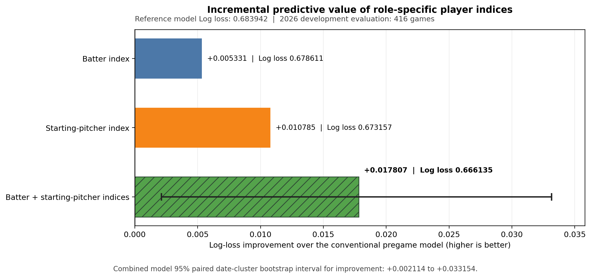
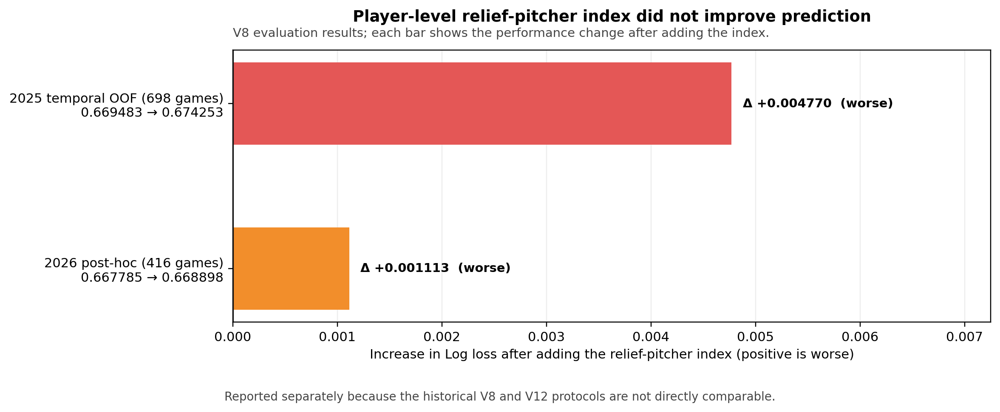

# 15Pick — Leakage-Controlled KBO Win-Probability Research

[](#reproduce-the-core-results)
[](docs/temporal_validation_and_leakage.md)
[](artifacts/RESEARCH_MANIFEST_SHA256.csv)
[](docs/scientific_status_and_claims.md)

[한국어 README](README.ko.md)

## Summary

I built [**15Pick KBO**](https://mypickkbo.com/), a fantasy-baseball website that transforms official KBO game records into role-specific composite player-performance indices so users can compare performance across batting and pitching roles. This research project directly designs a win-probability model and tests whether strict-prior averages of these indices provide additional pregame predictive information beyond conventional team-strength variables.

The project's main contributions and findings are:

- an end-to-end data pipeline built from 1,864 completed KBO games and 65,554 player-game records.
- creating a reliable analytical dataset through accurate player identification and role classification.
- designing leakage-controlled indices using only information available before each target game.
- directly experimenting with and comparing multiple models and training strategies to select the final win-probability model.
- evidence that the role-specific player-performance indices improved win-probability prediction beyond conventional team-strength variables.
- reproducible preservation of unsuccessful experiments, models, and prediction outputs.

In the 2026 development evaluation, the conventional pregame model recorded a Log loss of **0.6839**. Adding the batter index improved it to **0.6786**, adding the starting-pitcher index improved it to **0.6732**, and using both indices produced the best result of **0.6661**. The 95% date-cluster bootstrap interval for the combined improvement was **[-0.0332, -0.0021]**.

These results show that the role-specific player-performance indices provided incremental predictive information beyond conventional team-strength features.

For the complete research process, decisions, and results, see **Entire Process**.

[](#suggested-reading-order)

## Research question

> **Do role-specific 15Pick composite player-performance indices derived from official KBO game records provide incremental information for pregame win-probability forecasting beyond conventional team-strength features, and which player roles contribute the greatest predictive value?**


## Main result

### Best-observed V12 specification — trained on 720 earlier games, evaluated on 416 games

| Feature set | Log loss ↓ | Brier ↓ | ROC AUC ↑ | Accuracy ↑ |
|---|---:|---:|---:|---:|
| Constant `p(home win)=0.50` | 0.693147 | 0.250000 | 0.500000 | 52.40%* |
| Conventional pregame variables only | 0.683942 | 0.245313 | 0.575781 | 54.33% |
| + Batter index only | 0.678611 | 0.242599 | 0.603188 | 57.45% |
| + Starting-pitcher index only | 0.673157 | 0.239875 | 0.617343 | 57.93% |
| **+ Batter and starting-pitcher indices** | **0.666135** | **0.236498** | **0.635275** | **59.62%** |

For the combined model versus the conventional no-player-index model:

- Log-loss difference: **−0.017807**
- 95% paired date-cluster bootstrap interval: **[−0.033154, −0.002114]**
- Probability of lower Log loss: **98.69%**

The V12 conventional block already contains **team-level bullpen and post-starter run-prevention variables**. A separate **player-level relief-pitcher index** was tested earlier in V8 and was not retained: Log loss worsened from `0.669483` to `0.674253` in 2025 temporal OOF and from `0.667785` to `0.668898` in 2026 post-hoc evaluation. Because V8 used a different historical protocol, that result is shown separately rather than inserted into the V12 ranking table.





## Why the research process matters

The strongest part of this project is not that every experiment worked. It is that failures changed the research design.

| Problem discovered | Evidence | Root cause | Corrective action | Outcome |
|---|---|---|---|---|
| Weak 2026-only model | probabilities concentrated near 0.5; complex model degraded | small repeated-team sample and adaptive search | expanded to 2024–2026 official data | stronger and more stable temporal evidence |
| Away-starting-pitcher history missing | home starter eligibility 416, away 0 | asymmetric raw identity tokens | numeric identity reconstruction and side-specific audits | 832/832 model-period starters eligible |
| Role-contaminated histories | 78.11% of experienced starting-batter rows contained substitute history; 20.77% of starting-pitcher rows contained relief history | history key omitted role | role-aware parallel histories and start-only redesign | clean starter index became a strong signal |
| Broad complex-model search failed | V3 Log loss 0.677185 versus V2 0.670610 | feature proliferation and limited independent information | retained regulated logistic baseline | negative result preserved rather than hidden |
| Ceiling conclusion became invalid | earlier audit suggested little signal remained | ceiling was measured on contaminated features | suspended the claim | research question reopened after data repair |
| Initial batter candidate failed to add value | V8 batter addition worsened the V7 stack | limited score/mean/aggregation search | full V11.1 rebuild from official batting events | new batter block showed incremental value |
| Player-level relief index failed | 2025 domain delta +0.000009; stack worsened | actual reliever deployment unknown pregame | retained team-level prior post-starter run prevention | negative result documented and scope narrowed |
| Daily retraining failed to help | expanding/rolling adaptive models trailed static recent-window model | adaptation followed noise in a modest sample | preserved both clean CV and observed development candidates | future prospective comparison required |

The full causal record is in [`docs/research_journey.md`](docs/research_journey.md) and [`docs/failure_root_cause_ledger.md`](docs/failure_root_cause_ledger.md).

## Data foundation

| Component | Count |
|---|---:|
| Official schedule rows | 2,047 |
| Completed games | 1,864 |
| Cancelled or postponed | 183 |
| Batter occurrences | 47,353 |
| Pitcher occurrences | 18,201 |
| Total player-game occurrences | 65,554 |
| Official starting-lineup rows | 33,552 |
| Resolved occurrences | 65,554 / 65,554 |
| Name-only forced merges | 0 |
| Strict-prior history rows | 65,554 |
| Temporal violations | 0 |

The included V12 derived modeling table has 1,824 decision games: 710 in 2024, 698 in 2025, and 416 in 2026. Complete official raw responses are not redistributed in this repository.

## Player-performance indices

### Batter game index

```text
0.50 × 1B + 0.95 × 2B + 1.35 × 3B + 1.85 × HR
+ 0.42 × BB + 0.42 × HBP + 0.22 × SB
− 0.08 × SO − 0.32 × GIDP
```

The event total is normalized to a 4.2-plate-appearance rate, standardized using an early-2024 design reference, clipped to `[-500, 3000]`, and converted to a same-season strict-prior mean with `K=5` shrinkage. The official nine-player starting lineup is aggregated using mean performance, coverage, prior-game count, and minimum-side coverage.

### Starting-pitcher game index

```text
1000 × (
  0.216 × outs
  + 0.132 × strikeouts
  − 1.565 × home runs allowed
  − 0.557 × (walks + hit by pitch allowed)
)
```

Only starts are included in the history. Relief appearances are not mixed into the starting-pitcher prior. The model uses a `K=10` shrunk prior and coverage/reliability features.

See [`docs/player_index_design.md`](docs/player_index_design.md).

## Validation contract

- `source game date < target game date` for every historical feature;
- target-game outcomes excluded;
- all outcomes on the same date excluded;
- doubleheader game 1 not used for game 2 on the same date;
- imputation, scaling, model selection, and calibration fitted within training data;
- shuffled splits prohibited for primary evaluation;
- target-game actual relievers prohibited;
- cancelled games voided or excluded;
- date-cluster bootstrap used for paired uncertainty.

A crucial distinction is preserved: **2026 predictions have no within-game or same-date leakage, but 2026 was inspected during method comparison.** Therefore it is development evaluation, not a final untouched test.

## Research evolution

```mermaid
flowchart LR
    A[2026-only limited sample] --> B[Multi-season official foundation]
    B --> C[V1-V4 temporal models]
    C --> D[Identity and role-scope audit]
    D --> E[Clean start-only pitcher index]
    E --> F[V7 integration and stacking]
    F --> G[V8 batter and relief negative results]
    G --> H[V9 post-starter team run prevention]
    H --> I[V10 workload/matchup tests rejected]
    I --> J[V11.1 full batter-index rebuild]
    J --> K[V12 model and training-strategy comparison]
    K --> L[Two-model freeze and prospective ledger]
```



## Scientific status

| Specification | Selection data | Training rule | 2026 Log loss | Status |
|---|---|---|---:|---|
| `L2_C0.03_ALL_EQUAL` | 2024–2025 temporal CV | all 2024–2025 decision games | 0.667390 | clean CV-selected candidate |
| `L2_C0.1_RECENT_720` | selected after 2026 method comparison | most recent 720 pre-2026 games | 0.666135 | best observed development candidate |

No model is described as a future-proven production champion. The next confirmatory stage is an immutable prospective ledger.

## Reproduce the core results

```bash
python3 -m venv .venv
source .venv/bin/activate
python -m pip install --upgrade pip
pip install -e ".[dev]"
make reproduce
make verify
```

`make reproduce` retrains both frozen logistic specifications and all four role-ablation models from the included derived modeling dataset. It regenerates metrics, predictions, date-cluster bootstrap intervals, calibration tables, and standardized coefficients.

`make verify` additionally validates row counts, deterministic temporal ordering, same-date flags, SHA256 artifacts, published metrics, bootstrap values, and saved-model replay to `< 1e-12` maximum probability error.

Full historical V11.1/V12 research scripts are retained under [`research/authoritative/`](research/authoritative/). They are preserved as research evidence; the portable reproduction entry point is under [`scripts/`](scripts/).

## Repository map

```text
├── data/derived/              # 1,824-game derived modeling table and temporal folds
├── docs/                      # research design, journey, failures, limitations, claims
├── experiments/               # hypothesis → evidence → decision cards for every phase
├── models/frozen/             # saved CV and development model binaries
├── reports/frozen/            # authoritative V11.1/V12 result tables
├── reports/reproduced/        # outputs regenerated from the portable pipeline
├── research/authoritative/    # preserved V11.1/V12 historical execution code
├── research_records/          # decisions, audits, reports, and negative results
├── scripts/                   # reproduction, verification, figures, manifests
├── src/fifteenpick_prediction/# maintained reusable package
└── tests/                     # formula, temporal, bootstrap, model, artifact tests
```

## Suggested reading order

1. [`docs/research_question_and_contribution.md`](docs/research_question_and_contribution.md)
2. [`docs/research_journey.md`](docs/research_journey.md)
3. [`docs/failure_root_cause_ledger.md`](docs/failure_root_cause_ledger.md)
4. [`docs/data_lineage_and_quality.md`](docs/data_lineage_and_quality.md)
5. [`docs/temporal_validation_and_leakage.md`](docs/temporal_validation_and_leakage.md)
6. [`docs/model_selection_ablation_and_calibration.md`](docs/model_selection_ablation_and_calibration.md)
7. [`docs/reproducibility.md`](docs/reproducibility.md)
8. [`docs/scientific_status_and_claims.md`](docs/scientific_status_and_claims.md)

## Data and licensing

The repository distinguishes code, derived research tables, and official raw KBO responses. Raw responses and operational-service data are not included. Before making the repository public, review [`docs/data_release_policy.md`](docs/data_release_policy.md) and remove any artifact not covered by the intended release policy.

## Author

Jiho Choi — Data Analytics, The Ohio State University
