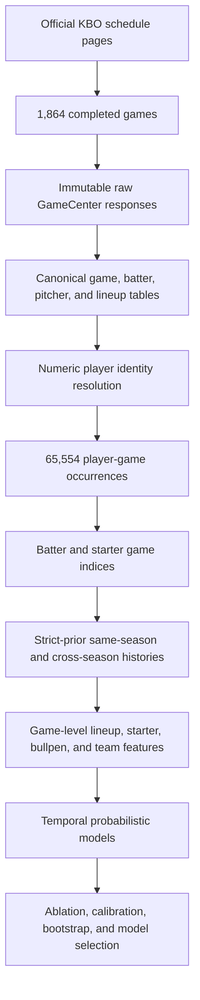

# Data Lineage

## Fixed data interval

- 2024-03-23 through 2024-10-01
- 2025-03-22 through 2025-10-04
- 2026-03-28 through 2026-07-09

## Core counts

- Schedule rows: 2,047
- Official completed games: 1,864
- Cancelled or postponed rows: 183
- Batter occurrences: 47,353
- Pitcher occurrences: 18,201
- Starting-lineup rows: 33,552
- Player-game occurrences: 65,554
- Final unresolved occurrences: 0

## Public-data policy

The repository publishes code, schemas, aggregate results, formulas, and synthetic examples. Complete official raw responses and large derived player-level tables are not redistributed in the main branch.
