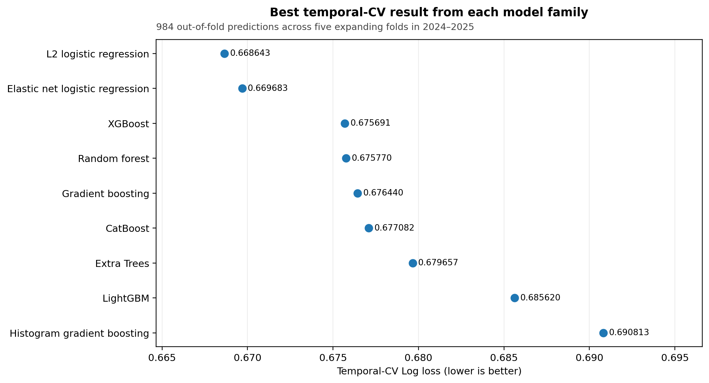
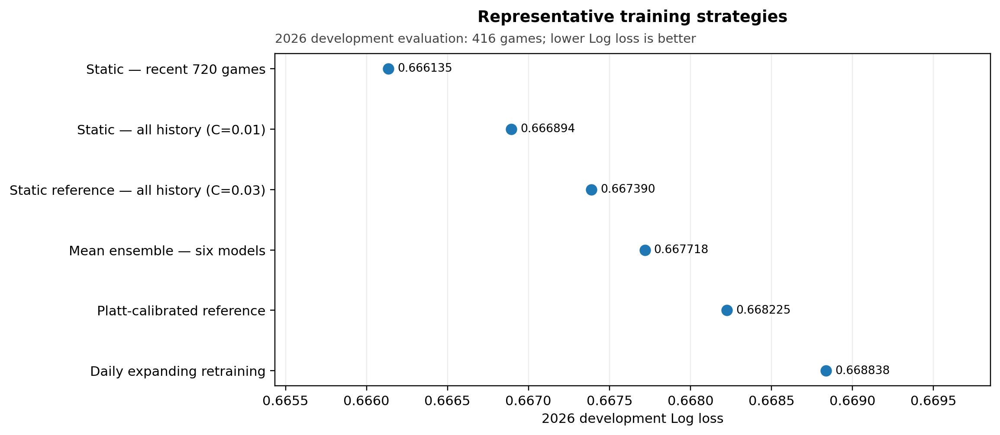
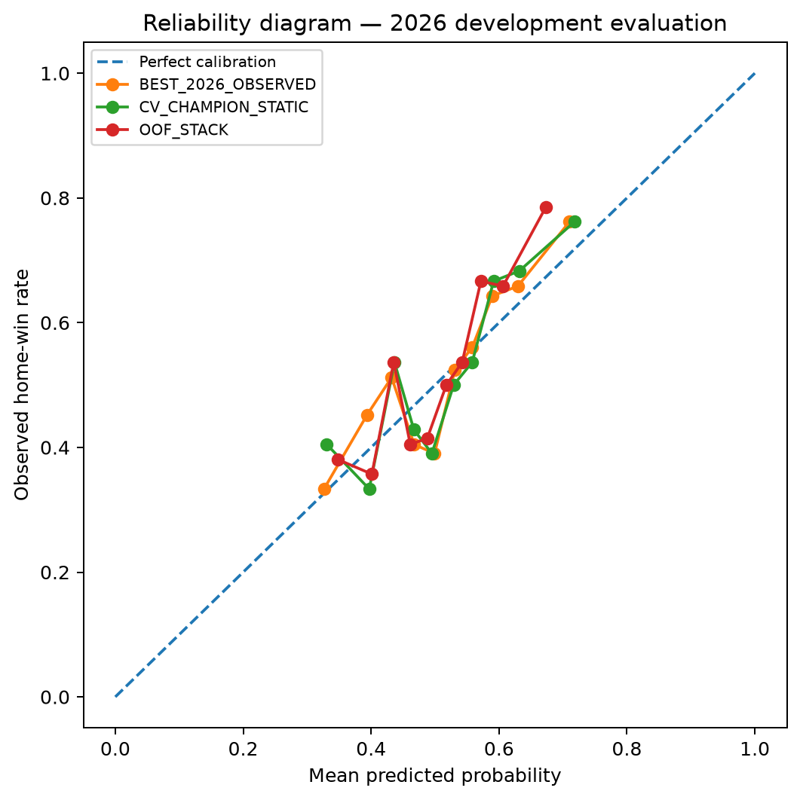
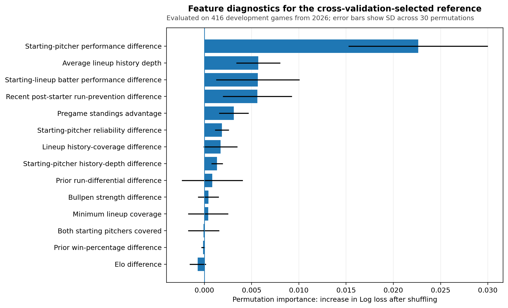

# Model selection, role comparison, and calibration

This chapter explains how the two retained model candidates were selected and how much additional predictive information came from the batter and starting-pitcher feature blocks. The player-index definitions were fixed before the comparisons reported here.

The prediction target is the probability of a home-team win before first pitch. Tied games are excluded from binary modeling, leaving 416 non-tie games from March 28 through July 9, 2026, in the development evaluation.

The analysis addressed three questions:

1. Which model family produced the best probability estimates under chronological validation?
2. Did changing the training window, retraining schedule, ensemble method, or calibration method improve performance?
3. How much additional predictive information came from the batter and starting-pitcher feature blocks?

The model-family comparison used 2024–2025 expanding temporal cross-validation. The later training-strategy and role comparisons used the 416 development games from 2026. Every 2026 prediction used only records from earlier dates, and all same-day results were excluded. However, 2026 outcomes were inspected during method comparison. These results are therefore development evidence rather than an untouched final test.

## Evaluation map

| Analysis | Data used | Purpose |
|---|---|---|
| Model-family selection | Five expanding temporal folds across 2024–2025; 984 out-of-fold predictions | Select the model family and regularization strength |
| Training-strategy comparison | 416 non-tie games from 2026 | Compare static windows, weighting, daily retraining, online updating, ensembles, and calibration |
| Role comparison | The same 416 games under two frozen logistic-regression specifications | Measure the additional information from batter and starting-pitcher features |
| Calibration and feature diagnostics | The same 2026 predictions | Describe probability calibration and model reliance; not used as causal evidence |

## Model-family selection

Forty-two configurations across nine model families were evaluated with five expanding temporal folds. In each fold, the training period occurred entirely before the validation period, and preprocessing was refitted using only the corresponding training rows.

Configurations were ranked using pooled Log loss plus a small stability penalty:

```text
selection score = pooled Log loss + 0.05 × fold-level Log-loss standard deviation
```

The selected configuration was L2-regularized logistic regression with `C=0.03`. In logistic regression, `C` is the inverse regularization strength, so smaller values apply stronger shrinkage. The selected model ranked first by the stability-adjusted score and also had the lowest pooled Log loss.

Elastic net was close, while the tree and boosting families produced higher Log loss. For this dataset and feature set, added nonlinear complexity did not improve temporal probability quality.

| Model family | Best Log loss ↓ | Brier ↓ | ROC AUC ↑ |
|---|---:|---:|---:|
| L2 logistic regression | **0.668643** | **0.237899** | **0.628609** |
| Elastic net logistic regression | 0.669683 | 0.238379 | 0.626490 |
| XGBoost | 0.675691 | 0.241304 | 0.611930 |
| Random forest | 0.675770 | 0.241450 | 0.609728 |
| Gradient boosting | 0.676440 | 0.241677 | 0.609234 |
| CatBoost | 0.677082 | 0.241958 | 0.609063 |
| Extra Trees | 0.679657 | 0.243255 | 0.599139 |
| LightGBM | 0.685620 | 0.245919 | 0.595763 |
| Histogram gradient boosting | 0.690813 | 0.248429 | 0.589110 |



The complete 42-configuration table is available in the [temporal cross-validation results](../reports/frozen/V12_MODEL_FAMILY_TEMPORAL_CV.csv).

## Training-strategy comparison

After selecting regularized logistic regression as the main model family, 130 model-and-training combinations were compared on the 2026 development period. The comparison included full-history and recent-window training, season weighting, time decay, daily expanding and rolling refits, online updates, model averaging, stacking, and separate calibration.

The lowest observed Log loss came from a static L2 logistic model with `C=0.1`, trained on the 720 most recent non-tie games before the 2026 season. Frequent retraining, model averaging, and post-hoc calibration did not improve on that result. Isotonic calibration was especially unstable in this sample.

| Representative method | Training scope | Log loss ↓ | Brier ↓ | ROC AUC ↑ |
|---|---|---:|---:|---:|
| Static model, most recent 720 games (`C=0.1`) | 720 games | **0.666135** | **0.236498** | 0.635275 |
| Static model, all 2024–2025 games (`C=0.01`) | 1,408 games | 0.666894 | 0.236835 | **0.637545** |
| Cross-validation-selected static reference (`C=0.03`) | 1,408 games | 0.667390 | 0.237034 | 0.631568 |
| Mean of six cross-validation-selected models | Six component models | 0.667718 | 0.237184 | 0.631429 |
| Platt-calibrated reference model | One calibrated model | 0.668225 | 0.237539 | 0.631568 |
| Daily expanding retraining (`C=0.03`) | 88 date-level refits | 0.668838 | 0.237708 | 0.629807 |
| Isotonic-calibrated reference model | One calibrated model | 0.725047 | 0.238443 | 0.626958 |



The complete comparison is available in the [learning-method result table](../reports/frozen/V12_2026_ALL_LEARNING_METHOD_RESULTS.csv).

## Why two model candidates were retained

The lowest observed 2026 result and the model selected without consulting 2026 outcomes are not the same specification. Both were therefore frozen rather than replacing one with the other.

| Candidate | Selection basis | Training data | 2026 Log loss | Status |
|---|---|---|---:|---|
| Cross-validation-selected reference | Chosen from the 2024–2025 expanding folds | All 1,408 non-tie games from 2024–2025; L2 `C=0.03` | 0.667390 | Selected without using 2026 outcomes |
| Best observed development model | Chosen after comparing training strategies on 2026 results | Most recent 720 pre-2026 games, 2024-09-24 through 2025-10-04; L2 `C=0.1` | **0.666135** | Lowest observed development result |

The recent-720 model improved Log loss by `0.001255` relative to the cross-validation-selected reference. A paired date-cluster bootstrap, which resamples whole game dates rather than individual games, produced an interval of `[-0.004790, 0.002336]`, with lower Log loss in `74.61%` of bootstrap replicates. Because the interval includes zero, the observed difference does not establish clear superiority between the two candidates.

## Role-specific comparison

Under each frozen specification, the logistic-regression pipeline was refitted separately for four predefined feature sets. The blocks were fixed before this comparison.

| Feature block | Included information |
|---|---|
| Conventional pregame variables | Elo, prior win percentage, prior run differential, standings advantage, team-level bullpen strength, and recent post-starter run prevention |
| Batter block | Starting-lineup performance mean, lineup-history coverage, average prior-game count, and minimum team coverage |
| Starting-pitcher block | Prior start-only performance, prior-start count, reliability, and a both-starters-covered indicator |

The exact player-index formulas and prior calculations are documented in [role-specific player-index design](player_index_design.md).

All values below are 2026 Log loss.

| Feature set | Features | CV-selected reference | Best observed development |
|---|---:|---:|---:|
| Conventional pregame variables | 6 | 0.683516 | 0.683942 |
| Conventional + batter features | 10 | 0.679916 | 0.678611 |
| Conventional + starting-pitcher features | 10 | 0.672733 | 0.673157 |
| Conventional + batter and starting-pitcher features | 14 | **0.667390** | **0.666135** |

The ordering was consistent under both frozen specifications:

- batter features improved on the conventional model;
- starting-pitcher features produced the larger standalone improvement;
- the combined model produced the lowest Log loss.

This pattern supports complementary information from the two roles rather than an improvement driven by only one feature block.

| Combined model versus conventional model | Log-loss difference | 95% paired date-cluster interval | Bootstrap replicates favoring the combined model |
|---|---:|---:|---:|
| Cross-validation-selected reference | −0.016127 | [−0.032066, 0.000425] | 97.17% |
| Best observed development model | **−0.017807** | **[−0.033154, −0.002114]** | **98.69%** |

These percentages are the shares of 20,000 date-cluster bootstrap replicates in which the combined model had lower Log loss. They are not posterior probabilities that the model is truly superior.

The interval for the cross-validation-selected reference narrowly includes zero. The interval for the best observed development specification does not, but that specification was selected after reviewing 2026 outcomes. The stronger development result should therefore not be presented as independent final confirmation.


Machine-readable metrics and bootstrap results are available in the [role-comparison table](../reports/reproduced/player_index_ablation.csv) and [paired bootstrap table](../reports/reproduced/player_index_ablation_bootstrap.csv).

## Relief-pitcher result

A player-level relief-pitcher feature block was evaluated separately in an earlier experiment. In the standalone 2025 relief-domain comparison, the result was effectively null: Log loss changed from `0.687435` to `0.687444`. When the same feature block was added to the stronger integrated model, Log loss increased from `0.669483` to `0.674253` in the 2025 temporal out-of-fold evaluation and from `0.667785` to `0.668898` in the 2026 post-hoc evaluation. It was therefore not retained.

The relief-pitcher experiment used a different historical protocol from the role comparison above, so its values are reported separately rather than placed in the same ranking table. The retained conventional block still includes team-level pregame bullpen strength and post-starter run-prevention measures.


See [the relief-pitcher negative-result record](relief_pitcher_index_negative_result.md) for the construction, evaluation, and limitations of that experiment.

## Probability calibration

Log loss and Brier score are the primary evaluation measures because the task is to estimate probabilities rather than only select a winner. ROC AUC describes ranking ability, while accuracy is reported as a secondary threshold-dependent measure.

Calibration intercept and slope summarize whether the probabilities were systematically shifted or too extreme. The ideal values are an intercept of `0` and a slope of `1`.

| Candidate | Calibration intercept | Calibration slope |
|---|---:|---:|
| Cross-validation-selected reference | 0.0379 | 0.9782 |
| Best observed development model | 0.0435 | 1.0109 |

The point estimates for both calibration intercept and slope were close to their ideal values in the 2026 development period. These are descriptive estimates, not independent confirmation of future calibration. Each decile contains only 41 or 42 games, so observed win rates can vary substantially within individual bins.



The underlying bins and summary estimates are available in the [calibration-decile table](../reports/reproduced/calibration_deciles.csv) and [calibration intercept-and-slope table](../reports/reproduced/calibration_intercept_slope.csv).

## Feature diagnostics

Permutation importance was calculated for the cross-validation-selected reference model on the 416 development games from 2026. It measures the increase in Log loss after one feature is shuffled while the fitted model is held fixed.

| Feature | Mean importance | Standard deviation |
|---|---:|---:|
| Starting-pitcher performance difference | 0.022628 | 0.007373 |
| Average lineup history depth | 0.005709 | 0.002330 |
| Starting-lineup batter performance difference | 0.005651 | 0.004420 |
| Recent post-starter run-prevention difference | 0.005611 | 0.003659 |
| Pregame standings advantage | 0.003110 | 0.001562 |

Importance values are averages over 30 permutations. The reported standard deviations describe variation across those shuffles and are not confidence intervals.

The starting-pitcher performance feature was the strongest individual diagnostic. Batter performance and lineup history depth also contributed. These values are descriptive rather than causal, and correlated features can divide or mask importance. The role-block comparisons above provide more direct evidence about the incremental value of a role than any one-feature ranking.



The full 14-feature table is available in the [permutation-importance results](../reports/frozen/V12_2026_PERMUTATION_IMPORTANCE_CV_CHAMPION.csv).

## Interpretation

The completed comparison supports four conclusions.

1. Strongly regularized logistic regression provided the most stable probability estimates under chronological validation; more complex model families did not improve Log loss.
2. A static recent-history model produced the lowest observed 2026 development loss, while daily retraining, ensembles, and separate calibration did not provide a consistent advantage.
3. Starting-pitcher features produced the larger standalone improvement, and batter features added complementary information. The combined model performed best under both frozen specifications.
4. The evidence remains developmental. The two retained candidates must be compared on future games recorded before first pitch before either can be described as prospectively validated.
